# Ksawery

**Embedded Security Engineer**

## Overview

Professionally, I build cryptographic libraries for embedded systems and secure elements,
end to end: from SHA-3 and AES through ECC and RSA to post-quantum ML-KEM and ML-DSA,
hardened against side-channel and fault injection attacks.

What drives me is the place where mathematics, hardware and security meet:
turning a standard into code that is fast, small and hard to break.

## Contact

[LinkedIn](https://www.linkedin.com/in/ksawery-mozdzynski/)
